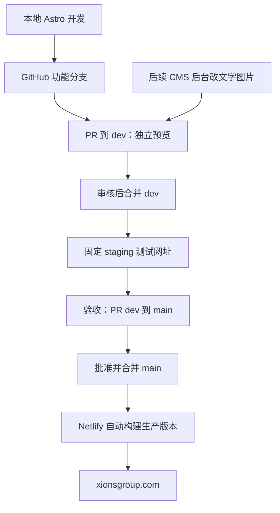

# XIONS GROUP 网站执行与维护手册

日期：2026-09-12。范围：实施方案，尚未创建网站代码、GitHub 仓库或 Netlify 项目，也未修改域名。

## 一、选定架构

第一版：Astro 静态多页面网站 + TypeScript + 组件化 CSS + GitHub + Netlify。

文字从独立 JSON / Markdown 文件读取；代码决定版式，内容文件决定文字和图片。动效先用 CSS 与少量 JavaScript。需要复杂动画时再按模块引入动画库。静态 Astro 可直接部署 Netlify，不需要为第一版添加服务端适配器。这里的“静态”指提前生成网页，仍支持菜单、画廊、动画和接入表单服务。

推荐先完成法文版，保留英文内容结构；英文经审核后启用，未翻译页面不显示无效语言切换。

Netlify 负责构建、托管和网络分发；GitHub 负责源码与历史；Astro 负责生成页面；CMS 是另行配置的内容后台。

| Shopify 概念 | 本项目对应做法 |
|---|---|
| Liquid section | Astro section 组件，如 Hero.astro、BrandGrid.astro |
| Theme template | 页面与布局文件 |
| Section settings/schema | JSON/Markdown 字段 + 内容校验；接 CMS 后映射为输入框 |
| Shopify Files | 仓库里的图片文件或独立媒体服务 |
| Theme editor | 可另接 CMS；并不会天然带有拖拽编辑器 |
| Publish theme | 经 PR 合并到 main，Netlify 自动构建与发布 |

## 二、整体链路



首次初始化 main 只放项目骨架，尚不绑定正式域名；其后的网站开发都在 dev / 功能分支进行。每次发布 main 都是重新构建一次：测试与生产必须保持运行时、依赖和构建配置一致，外部内容也需考虑版本一致性。

## 三、前期准备：步骤 1—6

### 1. 明确首发范围

- 页面：首页、集团、品牌列表与品牌详情、承诺、传播、招聘、联系、法律页面。
- BETENOIR 可先做预告；缺少职位时显示暂无职位并保留自荐入口。
- 先确定首页与一个品牌详情页的风格，再套用其他页面。
- 按用户决定保留现有法文内容，仅作基础修正。图片占位指令只用于开发，不应成为正式页面文字。

### 2. 建立公司账号与权限

- GitHub：以公司名建立 Organization，仓库放在组织名下。
- Netlify：建立或使用公司的 Team，项目归该团队。
- contact@xionsgroup.com 作为公司联系/账单通知邮箱；成员独立登录、受邀访问，必要时配置个人专属公司邮箱。
- 指定代码维护者、内容审核者和正式发布批准人；安排可接手的第二位管理员。
- 公司保管域名注册商、DNS、邮箱与恢复资料；开启两步验证。凭据不写进项目文件。

### 3. 查清域名现状

找出 xionsgroup.com 的注册商、当前 DNS 管理方、是否已有网站、是否绑定 Shopify、邮箱服务商。导出现有 DNS 记录作为变更前记录。此时不切换域名。

### 4. 整理素材

收集 Logo、品牌主图、人物照、活动图、授权字体。源 PSD/TIFF/摄影原片存公司素材库，网页只使用适当尺寸的发布副本。照片补 alt 文本、署名和裁切焦点。法律资料占位符另列为首发待补项，不能由开发者猜填。

### 5. 安装开发工具

在 Mac 安装 Git、兼容当前 Astro 的 Node.js LTS、编辑器（Codex 或 VS Code）。建议同时安装 GitHub CLI，方便浏览器登录授权。检查：

```bash
node -v
npm -v
git --version
gh --version
```

当前 Astro 官方安装页要求 Node.js 至少 v22.12.0，不支持奇数版本。实际搭建时选择兼容的 LTS，写入 `.nvmrc`，并让 Netlify 使用相同版本。依赖用 package-lock.json 固定。

### 6. 隔离网站源码

当前 web 里只有文案，工作区不是 Git 仓库。建议专门建立 `web/site` 作为网站 Git 根目录，而不是把整个 Xionsgroup 公司资料目录上传。

推荐目录（下列 site 结构是待创建的方案）：

```text
/Users/seajelly/Documents/Xionsgroup/web/
  xions grouo web text.rtf             原始文案
  xions-group-web-text-corrected.rtf   基础修正版
  XIONS-GROUP-网站执行与维护手册.md
  site/                              网站专属 Git 根目录
    src/
      pages/                         页面路由
        index.astro
        fr/
        en/
        404.astro
      layouts/                       共用页面框架
      components/
        Header.astro
        Footer.astro
        sections/
          Hero.astro
          BrandGrid.astro
          TeamSection.astro
          NewsGrid.astro
          ContactForm.astro
      content/
        pages/fr/home.json
        pages/en/home.json
        brands/fr/lentropiste.md
        news/fr/
      assets/images/                 固定设计图，可走 Astro 图片处理
      styles/                        字体、颜色、间距、动效
    public/
      images/                        已优化图片、后续 CMS 上传图片
      downloads/                     明确对外提供的下载文件
      fonts/                         获授权的字体
    scripts/                         校验与部署辅助脚本
    astro.config.mjs
    netlify.toml
    package.json
    package-lock.json
    .nvmrc
    .gitignore
    README.md
```

注意：`public` 中的文件会成为可通过网址访问的资源。这里不能放合同、简历或未授权原片。

## 四、本地开发：步骤 7—12

### 7. 创建 Astro 项目

在正式执行阶段，运行：

```bash
cd /Users/seajelly/Documents/Xionsgroup/web
npm create astro@latest -- site
cd site
npm run dev
```

安装向导选择最小项目、安装依赖；Git 初始化留到步骤 13，避免重复。开发网址以终端显示为准，通常是 `http://localhost:4321`。它只用于本地，不能直接当同事的远程预览链接。

### 8. 定义设计规则和共用组件

先写字体、颜色、宽度、留白、按钮、Header/Footer，再写 Hero、品牌网格、团队、新闻、表单。每个 section 接收内容参数，多页面复用。不要复制五份相同的导航或把全站塞进一个文件。

### 9. 把文字从页面代码抽出来

短字段用 JSON，长文用 Markdown；需要提供字段校验，确保缺少标题、错误链接或无效内容不会悄悄发布。例如首页文件内容：

```json
{
  "hero": {
    "title": "Imaginer la beauté de demain.",
    "buttonLabel": "Découvrir nos marques",
    "buttonHref": "/fr/marques/",
    "image": "/images/home-hero-v1.webp"
  }
}
```

页面组件读取这些字段。后续修改标题只改内容文件，或由 CMS 修改同一文件。不要使用 RTF 作为网站运行时内容源；修正版仅是导入起点。

### 10. 实现页面与手机布局

先首页与一个品牌页，再铺其他页面。实现导航、按钮、图片、404、页面标题、分享卡片、站点地图、语言链接；启用第二语言时配置对应关系。品牌官网外链用实际地址，缺地址时不放空按钮。

### 11. 接通联系功能

首版建议 Netlify Forms：在预渲染 HTML 中定义具名表单、字段 name、`data-netlify="true"`、成功页及垃圾提交防护；Netlify 后台开启表单检测，再重新部署，确认 Forms 列表识别出表单，并配置 contact@xionsgroup.com 的通知。

必须在部署网址提交测试，确认后台收到记录且邮箱收到通知。本地能点按钮不代表远端收件成功。测试和正式提交需要标识或分别处理，避免混入日常询盘；如要求强隔离，再考虑独立测试项目。简历附件不是公开媒体，不要放到 public。

### 12. 本地构建检查

```bash
npm run build
npm run preview
```

build 把源代码、文字、图片转换为 `dist` 发布文件；preview 查看构建结果。确认所有页面可访问、手机端无溢出、法文重音正常、链接和图片正确。实现时补充内容/类型校验和构建检查，并让 PR 必须通过。`npm run dev` 与 Git 的 `dev` 分支是不同概念。

## 五、本地连接 GitHub：步骤 13—17

### 13. 初始化网站仓库

在 site 中配置 .gitignore，至少忽略：

```gitignore
node_modules/
dist/
.astro/
.netlify/
.env
.env.*
!.env.example
.DS_Store
```

`.env.example` 只含字段名和假值。不要忽略 package-lock.json。再运行：

```bash
cd /Users/seajelly/Documents/Xionsgroup/web/site
git init -b main
git status
git add .
git diff --cached --stat
git commit -m "Initialize XIONS GROUP website"
```

提交前检查暂存内容不含公司其他资料或密钥。如果已由向导初始化 Git，则先检查分支后跳过 git init。首次骨架提交完成后再按后续步骤建立 dev。

### 14. 在 GitHub 创建空仓库

GitHub → New repository → Owner 选公司 Organization → 名称例如 `xionsgroup-website` → Private → 不额外初始化 README/.gitignore/license（本地已有历史）→ Create repository。仓库是否收费、私有仓库保护功能是否可用，按组织当前计划核实。

### 15. 登录并绑定远程地址

```bash
gh auth login
gh auth setup-git
```

登录时选 GitHub.com、HTTPS、浏览器登录。再复制仓库页面给出的 HTTPS 地址；把下面 OWNER 替换为公司组织的真实标识：

```bash
git remote add origin https://github.com/OWNER/xionsgroup-website.git
git remote -v
git push -u origin main
git switch -c dev
git push -u origin dev
```

Git 不使用 GitHub 网页密码作为 HTTPS 推送密码。也可用 GitHub Desktop 完成同等操作。绑定完成后，在网页确认 main、dev 两个分支及文件都存在。

### 16. 建立发布规则

GitHub 仓库 Settings → Rules / Rulesets 或 Branches → 针对 main 配置禁止直接推送、禁止强推/删除、要求 PR、审核与构建通过。具体可用功能随计划变化；先产生一次真实检查，再选其准确名称为必需检查。不要要求一个不存在的检查，也不要在只有一人的团队设无法满足的他人审批。

main 为默认及生产分支；功能 PR 的目标明确选 dev。保留长期 dev 分支，避免发布 PR 合并后误删它。短期分支可以在合并后删除。

### 17. 日常开发分支

工作区无未提交修改时，从最新 dev 开始：

```bash
git switch dev
git pull --ff-only origin dev
git switch -c feat/homepage
```

修改、构建检查后：

```bash
git add .
git diff --cached --stat
git commit -m "Build homepage sections"
git push -u origin feat/homepage
```

不必每改一行都推送；本地频繁保存和预览，完成一个可审核改动再推送。

## 六、GitHub 连接 Netlify：步骤 18—22

### 18. 提交构建配置

在 site 根目录创建 netlify.toml，通过 dev 流程提交；第一轮骨架也可以包含此配置：

```toml
[build]
  command = "npm run build"
  publish = "dist"
```

因为仓库根就是 site，Netlify Base directory 留空，不填写 web/site。固定 Node 版本与本地一致。静态多页面 Astro 不要套用 SPA 的 `/* → /index.html` 通配重写。

### 19. 导入 GitHub 仓库

Netlify 登录公司 Team → Add new project / Import an existing project → GitHub → 选择公司组织和仓库。

首次安装/授权 Netlify GitHub App 时只授权所需仓库；若组织要求 Owner 批准，交由管理员批准。OAuth 网页能登录但仓库不可见时，检查 App 是否获准访问该组织/仓库。

### 20. 配置首次构建

确认生产分支 main、Base directory 空、Build command `npm run build`、Publish directory `dist`。点击部署，等待成功，在 Deploys 中检查构建日志与 commit 标识。构建失败先解决第一条真实错误，不反复盲目重试。

此时先生成 Netlify 默认网址（形如 `PROJECT.netlify.app`，以后台真实分配为准），不急着绑定正式域名。默认网址即使未绑域名也可能公开可访问；未发布内容需要访问保护。

### 21. 开启 dev 固定测试站

Project configuration → Build & deploy → Continuous Deployment → Branches and deploy contexts → Configure → Branch deploys → Let me add individual branches → 输入 `dev` → Save。

向 dev 推送一次正常更新后确认测试部署成功；固定地址形如 `https://dev--PROJECT.netlify.app`。同事以后访问这一个地址即可看到最新成功部署的 dev。Branch deploy 默认不会自动启用。第一版不需要为了测试网址再配置 staging.xionsgroup.com。

### 22. 开启 PR 预览并控制可见性

同一设置处启用 Deploy Previews。GitHub 创建 `feat/homepage → dev` 的 PR；等待 Netlify check 完成，在 PR 的检查详情或 Netlify Deploys 打开预览。地址形如 `https://deploy-preview-12--PROJECT.netlify.app`。

PR 预览的目标分支必须是生产分支，或已启用 Branch Deploy 的分支，因此步骤 21 对目标 dev 很重要。向同一 PR 推送修改后，预览地址会更新为新的成功构建。

预览版做 noindex 并验证实际响应，避免生产版误带 noindex。内容需要保密时，在 Access & security → Visitor access → Password Protection 配置可用的非生产访问保护；能力依计划核实。私有 GitHub 仓库不会自动让部署网站变私有。

## 七、验收、上线与回滚：步骤 23—29

### 23. 功能预览验收

在 PR 预览检查该项改动；通过后合并到 dev。Netlify 重新构建 dev，固定 staging 更新。每条反馈标明页面、设备、具体位置和期望效果。

### 24. 整站验收

使用 dev 固定测试站检查所有页面、移动端、导航、字体、动效、减少动态模式、图片、表单、邮件收件、404、外链、SEO 和现有域名迁移所需旧 URL 重定向。没有真实职位/品牌链接的入口必须有正常状态。法律资料中的 XXX 与内部图片指令列入首发清理项。

### 25. 正式发布 PR

GitHub → Pull requests → New pull request → base: main，compare: dev。写明这一版的改动、预览网址、检查结果。检查应对应最新提交；有新修改后重新验收。

批准后用普通 Merge commit 合并长期 dev 到 main，保持分支历史容易同步。main 更新触发生产构建。第一次发布可先在默认 Netlify 网址验收，然后进行域名切换。

发布成功后，从最新 main 同步回 dev（如果 dev 也受保护，则通过 main → dev 的 PR）：

```bash
git switch dev
git pull --ff-only origin dev
git fetch origin
git merge origin/main
git push origin dev
```

先处理冲突并重新检查再提交，不要强推覆盖远端。长期分支发布不建议反复 squash 后不做同步。

### 26. 添加正式域名

Netlify → Domain management → Production domains → Add a domain，加入 xionsgroup.com 与 www.xionsgroup.com，指定一个主域名。打开 Pending DNS verification，读取该项目给出的准确记录。

### 27. 在当前 DNS 服务商修改网站记录

建议保持现有 DNS 服务商，按 Netlify 的实际指引修改根域名的 ALIAS/ANAME/A 和 www 的 CNAME（依服务商支持情况而定），不要复制网上过时 IP。

保留邮箱的 MX、SPF、DKIM、DMARC 和其他现用验证记录。不要直接清空 DNS 或盲目更换 Nameservers。若已有 Shopify 网站，这一步会切换对应域名的网站流量；此前必须确认旧站/商店是否仍要保留及其新入口。保留旧网站可用，直到新站与邮件验证完成。

### 28. 确认 HTTPS 与上线结果

等待 DNS 生效，在 Netlify 验证解析与 HTTPS 证书。分别访问根域名、www、手机网络下的正式网址，确认主域名跳转、页面、表单、图片和邮箱收发。生产页面允许收录、canonical 指向正式网址，站点地图没有 preview 地址。

Netlify 构建成功仅代表发布成功，域名配置和表单收件仍需要单独确认。随后记录生产 deploy、Git commit 和发布日期。

### 29. 回滚

如果新版故障，在 Netlify Deploys 中选仍保留的上一条成功生产部署，使用 Publish deploy 恢复；必要时暂时锁定自动发布，防止下一次构建覆盖恢复版。然后通过 Git revert / 修复 PR 同步修正 main，并同步 dev，验证后恢复自动发布。

Netlify 恢复部署不会撤销 GitHub 提交、表单记录或外部媒体变化；部署保留期限也需纳入交接说明。

## 八、图片具体存在哪里

第一版推荐：网页发布图片随网站仓库保存；大量媒体或视频再选独立媒体服务。

```text
公司素材库：原片/PSD/大视频（原始备份）
    ↓ 选图、裁切、压缩
本地 site/public/images 或 src/assets/images
    ↓ Git push
GitHub：发布图片与代码版本
    ↓ Netlify build
Netlify CDN：向访客发送上线图片
```

- `src/assets/images`：开发维护的设计图片，使用 Astro Image/Picture 等处理，生成尺寸/格式合适的版本。
- `public/images`：方便内容字段和 CMS 引用。文件按原样复制，不会只因放入文件夹就自动压缩；上传前优化，或后续专门配置图片处理链路。
- 公司素材库：原文件与授权证明，不提交到网站仓库。
- 视频：短小压缩片段可随网站发布；长片/大量视频使用专门视频或媒体服务，避免持续撑大 Git 历史和首屏下载。
- 表单附件：放受控表单/文件服务，不能当公开网站图片保存。

文件名用小写英文和连字符，如 `lentropiste-hero-v2.webp`；更换图片优先新文件名并更新引用，便于缓存更新与回滚。删除旧图前查引用。建议起始目标：大图约 200–500 KB、卡片图约 80–200 KB，最终以视觉质量、显示尺寸和手机实测调整；这不是平台硬限制。不要把数十 MB 摄影原片直接放到网页。

## 九、如何快速改文字与图片

### 路线 A：首发最快，文件编辑

你告诉 Codex 要改哪页、哪句话或哪张图；Codex 改内容文件 → 本地检查 → GitHub → 预览 → 审核 → main。可在 GitHub 网页直接编辑 JSON/Markdown 并新建分支发 PR，不强制必须回本地电脑。不要直接编辑 main。

这条路线没有可视化后台，但没有额外 CMS 的设置时间；文件格式需要小心，自动校验能减少失误。

### 路线 B：需要自行经常更新时，加 Decap CMS

推荐使用 GitHub backend + editorial_workflow；内容与媒体仍放 GitHub，后台只是更方便的编辑入口。

实施步骤：

1. 配置页面、品牌、新闻的结构化内容字段。
2. 添加 `public/admin/index.html` 和后台配置，设置登录授权；使用受支持的 OAuth 流程，不在前端写入 client secret 或个人 token。
3. 配置 GitHub 组织仓库及目标 `branch: dev`，不指向 main。
4. 开启 `publish_mode: editorial_workflow`，草稿形成分支与 PR。
5. 映射首页标题、正文、品牌文案、图片、alt、链接等字段；媒体目录设为 `public/images/uploads`，公共路径设为 `/images/uploads`。
6. 授予编辑者必要的 GitHub 仓库权限，验证登录、保存草稿、图片上传、PR 预览和合并权限。
7. 后台批准发布仅进入 dev；公司最终发布者另走 dev → main，把“发布到测试”和“发布到官网”说明清楚。
8. 验证 CMS 预览选到正确的 Netlify 检查；后台编辑框的预览不能替代真实部署验收。

示意配置片段（非完整可运行后台）：

```yaml
backend:
  name: github
  repo: OWNER/xionsgroup-website
  branch: dev
publish_mode: editorial_workflow
media_folder: public/images/uploads
public_folder: /images/uploads
```

编辑者之后可以在 /admin 选页面、改字、上传图片、保存草稿，无需启动本地编辑器。上线仍需等构建完成。后台不会自动拥有 Shopify 那样任意增加/拖动所有 section 的能力；要开放排序、开关、样式选项，需要预先实现对应字段与组件。

当前赶时间，建议先路线 A，让内容结构一开始就兼容后台。若日常更新立即由不写代码的同事承担，则把路线 B 加入首发范围。Decap 的 GitHub backend 需要编辑者有仓库推送权限；如果未来要求编辑者完全不接触代码权限，应另评估独立内容服务及其权限、费用、备份和预览机制。

## 十、维护规则与常见问题

| 情况 | 如何处理 |
|---|---|
| 改了一句话但网页没变化 | 检查改的是哪个分支、部署是否成功、是否看错网址；本地保存不等于上线 |
| 本地正常、Netlify 失败 | 检查 Node/锁文件、缺失环境变量、未提交文件、大小写路径、构建日志 |
| 网站正常但联系不到人 | 查 Netlify Forms 是否识别、提交是否进入后台、邮箱通知是否设置、垃圾邮件 |
| PR 没有预览 | 查 Netlify GitHub App 权限、Deploy Previews 开关、PR 目标分支是否是 main 或已开启部署的 dev |
| 图片换了还是旧的 | 检查实际部署分支及路径；新版本文件名比反复清缓存更可靠 |
| 域名访问异常 | 查 DNS 指向、冲突记录、证书、主域名设置，不先动邮箱记录 |
| GitHub 私有但预览能公开打开 | 仓库权限和网站访问是两套机制，要另设部署访问控制 |
| 同时多人/多个 AI 工作 | 每项工作一个短分支，先同步最新 dev，避免在同一文件反复覆盖 |

维护交接至少包含：README 的启动/构建方法、内容字段说明、图片规范、分支/发布规则、回滚方法、账号负责人、域名记录、依赖版本和表单收件配置。

日常：改内容并验收。每月：查看构建/流量费用、表单收件、链接与依赖安全提醒，更新依赖也走预览。按需：开发新 section 或新页面。不必每月重做网站，也不必每次手工上传 dist。静态发布文件可以迁移其他托管平台；Netlify Forms、访问控制等平台服务迁移时需另作替换。

## 十一、本次已完成与未完成

已完成：保存本手册；生成保留原始 RTF 格式的基础修正版和纯文本副本；以提取文本 diff 验证仅五处变更。

五处修改：Splenn → Spleen；Bertrand Duchaufour 的同位语逗号；SUNLUTION 的法文连接表达；章节 4 编号格式；未满 18 岁句中的逗号。

保留：原文案文件、全部品牌与营销叙述、奖项/科学主张、Coming soon，以及现有法律内容。修正版不是事实核验版或法律定稿；法律占位符与不存在功能的说明仍需在上线准备中处理。

尚未执行：搭建 Astro、初始化 Git、创建云端账号/仓库/项目、配置 CMS、连接 Netlify、改变 DNS、上线。手册中的 OWNER、PROJECT 与 site 目录结构都是待落实的示例。

## 官方参考

- [Astro 安装](https://docs.astro.build/en/install-and-setup/)
- [Astro 部署到 Netlify](https://docs.astro.build/en/guides/deploy/netlify/)
- [Astro 图片处理](https://docs.astro.build/en/guides/images/)
- [GitHub：上传本地仓库](https://docs.github.com/en/migrations/importing-source-code/using-the-command-line-to-import-source-code/adding-locally-hosted-code-to-github)
- [Netlify Branch Deploy](https://docs.netlify.com/deploy/deploy-types/branch-deploys/)
- [Netlify Deploy Previews](https://docs.netlify.com/deploy/deploy-types/deploy-previews/)
- [Netlify 外部 DNS](https://docs.netlify.com/manage/domains/configure-domains/configure-external-dns/)
- [Netlify 部署管理与恢复](https://docs.netlify.com/deploy/manage-deploys/manage-deploys-overview/)
- [Netlify 访问保护](https://docs.netlify.com/manage/security/secure-access-to-sites/password-protection/)
- [Decap GitHub backend](https://decapcms.org/docs/github-backend/)
- [Decap 编辑审核流程](https://decapcms.org/docs/editorial-workflows/)
