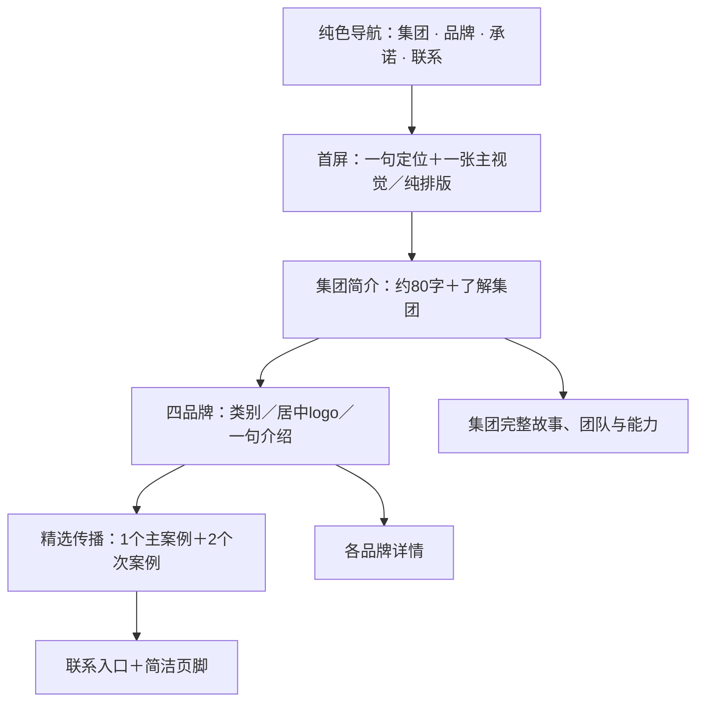

# XIONS Group 网站审查与极简设计方案

审查日期：2026-09-14。对照版本：dev 的 ea50c54；内容依据：本地 `local-materials/content/xions-group-web-text-corrected.txt`。下文区分本次修改与后续设计建议。

## 1. 判断：方向正确，编辑取舍和真实素材不足

集团最有说服力的定位是「法国独立美妆集团：以创意与科学培育有独立个性的品牌」。网站应服务媒体、渠道、合作伙伴与人才，让访客迅速理解集团及四个品牌。

目前的优点：集团、品牌、承诺、传播、招聘、联系已经分为独立页面；四个品牌共用数据与模板，后续维护方便；浅底、黑字、少量酒红能形成统一气质；静态 Astro 与现有 GitHub/Netlify 链路适合这种企业展示站。

目前的不足：

- 首页同时出现愿景、品牌、国际活动、引言、集团职能、国际化 CTA 和大页脚；「创造、发展、传播」反复出现。篇幅长来自重复内容与统一大间距，而不只是文字多。
- 首屏渐变球体与品牌故事缺少直接关联，占据大量空间，却没有提供产品、人物或创作的真实信息。
- Faculty Glyphic 很有个性，但每个标题都放大，会让版式显得刻意。应只在关键标题发挥作用，普通标题用更小字号。
- 四品牌目前缺少正式 logo 和产品视觉。只有品牌名与背景色，难以表达「独立品牌组合」。
- 内页大量采用同一种「巨大标题→长文→三项原则→口号→CTA」，不同内容需要不同阅读节奏。
- 导航原有 5 个一级分类加联系图标，多个展开区又重复子页面、长说明和推广卡片；透明叠层影响可读性。
- 活动占位图片和活动组织 logo 不能代替品牌实际案例。比如「Présence officielle」等具体关系比原稿的活动传播描述更强，应有真实项目资料支持。

## 2. 原稿与现站：哪些保留、遗漏、需要核实

| 原稿内容 | 现站情况 | 处理建议 |
|---|---|---|
| 集团定位、创意／科学／创新 | 主线保留，多个页面重复改写 | 首页只留短介绍，完整故事放集团页 |
| 三人领导团队，要求合照 | 有姓名，无合照；此前增加了原稿没有的共同创始人及具体职务 | 本次移除未经原稿支持的职务与性别称谓，保留团队姓名；下一步用一张三人合照 |
| 集团成立于 2026 | 原稿与集团页采用 2026 | Pappers 记载法人创建于 2022、2025 更名；本次移除网站中未区分语境的成立年，不修改原始文档。若 2026 指集团品牌正式启动，应明确写“集团品牌启动”，由公司确认 |
| L’Entropiste：8 款香水、调香师、奖项及两组图片 | 香水名称、调香师、获奖叙述基本保留；图片缺失 | 品牌页补一张主视觉、一张产品组合、一项获奖证据；奖项日期与具体名称发布前对照证书 |
| Betenoir：即将推出 | 现站额外指定 2026 发布并扩写多个原则 | 建议改为短预告页，删除未获确认的具体上市年份，无需凑满模板 |
| Sunlution：研究背景、三条技术路线、临床测试与图片 | 研究背景和三路线保留，临床测试句子与图片未完整呈现 | 恢复已批准文案，不额外扩张功效；用科学／产品真实素材 |
| Masqly：使用部位、48h、成分、皮肤科测试、图片 | 核心描述保留，皮肤科测试未完整呈现，图片缺失 | 保留完整批准文案，安排产品与使用动作图 |
| 质量、伦理、环境：逐步改善 | 正文大幅压缩；旧导航额外出现认证、减碳等表达 | 本次移除旧导航的新增宣称；建议承诺页恢复原稿中的具体原则 |
| 活动、国际户外广告、媒体、数字传播四组画廊 | 只有活动占位画廊；其他组未完成 | 按“真实项目＋时间地点＋品牌＋一句结果”组织，不用无关图库填充 |
| 招聘岗位＋主动申请 | 有主动申请、没有实际岗位数据 | 可保留现状；有真实岗位后再添加列表 |
| 联系表单 | 有独立联系页 | UI 存在不等于投递链路已验收；上线前另行验证 Netlify 表单接收和通知 |
| 法律页 | 原稿大量 XXX；现站注册信息仍待补 | 依据公司资料补充 SAS、注册号、地址等；不把一般审查当作完整法律审核 |

公司资料参考：[Pappers 企业页](https://www.pappers.fr/entreprise/xions-group-912563319)。该页记载 SAS、SIREN 912 563 319、资本 10,000 欧元、巴黎注册地址、法人设立于 2022 年。创意领导团队与法定代表人不是同一个概念，不能直接替换或推断。

## 3. 具体参考与借用方式

**Mobbin 的访问范围说明：** 已定位现有浏览器中的 Analogue Agency 收藏链接；本次打开具体截屏页跳转至注册／登录，Chrome 读取未成功。因此没有宣称看过其会员截图，也没有把以下官网包装成已验证的 Mobbin 模板。Mobbin 是参考库，选定页面后仍需要在现有 Astro 中实现。

| 参考 | 适用位置 | 建议怎样转译到 XIONS |
|---|---|---|
| [Aesop 官网](https://www.aesop.com/) | 首页主视觉与品牌故事 | 官网将香氛故事、图片／视频、短说明与明确入口组合。XIONS 首屏只放一项主题和一个入口；用真实产品或创作画面承担情绪。舍弃购物车、商品轮播与多重营销入口 |
| [Aesop Library](https://www.aesop.com/library.html) | 新闻与品牌内容 | 借用按内容主题组织故事的方式。XIONS 采用“活动／媒体／品牌新闻”轻量分类，每个条目一张图、日期、标题，避免整页重复宣言 |
| [Kering Houses](https://www.kering.com/en/houses/) | 集团→品牌→品牌独立官网的信息架构 | 借用组合品牌与独立品牌详情的层级；四品牌展示保持同等权重。导航收敛成集团、品牌、承诺、联系，传播和招聘收在集团内。这里借用信息架构，不声称复刻其当前下拉动画 |
| [Analogue 官网项目列表](https://analogueagency.com/cases-overview) | 国际传播案例页 | 把活动画廊升级为精选案例：图像、项目名、类别、详情。只借用以作品为中心的组织方式，不采用设计工作室式夸张动态 |
| [Mobbin：Analogue Agency 收藏页](https://mobbin.com/sites/sections/2b7eeacf-fd00-4fee-a2b3-3aa8e8f679bc?fullpage=true) | 下一轮视觉对照 | 待登录后核对其项目布局与文字比例，不能仅凭收藏标题确定具体界面 |

在 Mobbin 下一轮优先筛选 Website / Navigation、Hero、Logo collection、Gallery / Editorial。每个候选仅记录四项：页面链接、适用模块、借用理由、不采用的部分。Aesop / Kering 是否在 Mobbin 有可用截图，本次未确认。

## 4. 建议的首页分布（下一轮内容取舍）

首页目标是让访客 30 秒内理解“集团做什么、有哪些品牌、如何进一步了解”。上述五段内容是下一轮建议；本次主要缩短排版间距，没有擅自删除原有首页业务模块。

## 5. 模板方案：共享结构，按内容配置

| 页面类型 | 推荐结构 | 图片安排 |
|---|---|---|
| 首页 | 独立首页构图 | 可选单张主视觉；不用强制自动轮播 |
| 集团／承诺 | 简短标题＋图文模块＋实际内容 | 集团用三人合照；承诺可无图，避免无关自然风景 |
| 品牌详情 | 品牌身份＋简介＋产品／技术内容＋相关入口 | 成熟品牌配置 hero、1–3 张内容图；首屏图可为空 |
| Betenoir | 品牌身份＋即将推出＋联系 | 可不放主视觉，不显示空画廊或重复“原则” |
| 传播／新闻 | 精选案例＋分类列表＋案例详情 | 使用带日期、品牌和说明的真实活动图 |
| 招聘／联系／法律 | 紧凑功能页面 | 默认不用大幅视觉；让行动和阅读优先 |

建议把 `heroImage`、`gallery`、`award`、`externalWebsite` 设为可选数据；无数据不渲染模块。保留同一个品牌模板，不应要求四个品牌有同样数量的段落和图片。

动效采用克制的 200–400ms 淡入、轻微色差、图片最多约 1.02 倍放大。尊重减少动态偏好，不锁滚动，不强制观看片头，不用鼠标追随、卡片浮起投影或连续视差。以上时长是本方案建议，不是从参考站测得。

## 6. 本次已修改与素材规格

- 纯色导航与下拉；移除分割线、阴影、箭头、营销侧栏与冗余描述。
- 三组菜单加 Contact；桌面支持悬停、点击、键盘向下键、Escape；手机有可滚动菜单及子页面入口。
- 全局标签、按钮、页脚、首屏辅助文案改正常大小写，正式品牌名称保持原有写法。
- 四品牌网格居中显示类别、身份区域、简介；删除编号和卡片浮起／变黑阴影效果。长简介在窄屏自然换行，不裁切成省略号。
- 缩短内页首屏与普通区块的默认留白，内页标题尺寸与首页区分。
- 移除重复的旧导航 CSS；修复品牌页未定义的字体变量与过大标题。
- 集团页移除原稿未支持的具体职务、共同创始人称谓和未经区分的成立年份。

**仍缺正式品牌 logo。** 当前显示的是品牌名文字占位，不是最终 logo。配置入口 `src/data/brand-logos.ts`，素材目录 `public/images/brands/<slug>/`；例如 `{ src: '/images/brands/masqly/logo.svg', width: 210 }`。这是待收到公司文件后替换的剩余项。

Logo 优先透明 SVG，使用实际图形的紧凑 viewBox；PNG 建议透明画布 1200×480px。显示区域高 112px、建议视觉宽度 180–240px，逐品牌光学校准，等比例 contain、不拉伸、不强制裁切。SVG 内如包含正式全大写字标应保持原设计。手机同样居中，宽度不能超出卡片。

未来主视觉建议桌面 2400×1500、手机独立 1080×1350 裁图，WebP/AVIF；正文图 1600px 级即可。首屏加载优先，其余懒加载；图片附带 alt、真实来源和使用范围。

## 7. 验证范围

本次构建与站内路径检查通过，浏览器检查桌面导航、键盘菜单、品牌模块及手机菜单。完整 `astro check` 还发现已有 archive 目录断链引用和 `src/config/indexing.ts` 缺少 Node 类型声明；这些是既有工程检查配置问题，不属于此次视觉修改，不能宣称全项目类型检查通过。

发布目标是 GitHub dev 与 Netlify branch deploy；main 不包含本次改动。
