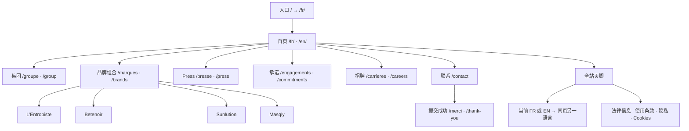
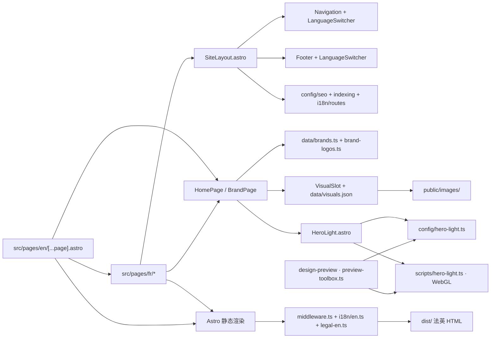
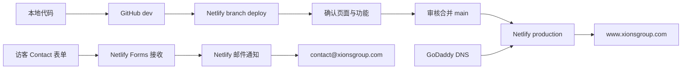

# XIONS GROUP 网站与代码 Map

核对日期：2026-09-22。依据当前 `dev` 源码整理，Mermaid 可在支持 Markdown 图表的阅读器/GitHub 中查看。

## 与 Graphify 的关系

已找到的 Graphify 地图属于另一项目：任务“建立Lentropiste代码关系地图”，文件 `/Users/seajelly/Documents/Lentropiste Web/code-map/index.html`。本仓库未发现已有 Graphify 导出。本页是 XIONS GROUP 当前结构的人工核对图，不是该 Shopify 地图的副本，也不是 Graphify 自动分析结果。新窗口无需先安装插件才能阅读本页。

## 页面结构

所有路径加 `/fr` 或 `/en` 前缀。准确配对表在 [routes.ts](../src/i18n/routes.ts)，当前每种语言 17 个路由（含成功页和404），sitemap 30个公开页面。团队是集团页 `#direction` 区域，并非独立团队路由。导航仅集团/品牌有桌面下拉；手机集团不展开团队，品牌展开四家。

首页顺序：**X Hero → Notre vision → Le portefeuille（四品牌）→ Présence internationale（六活动标识）→ Notre rôle → 页脚**。Press 的活动图库在 Press 页面，不全部堆入首页。

## 代码关系

英文入口复用法文组件，在构建阶段由 middleware/parse5 翻译 HTML；不是浏览器在线翻译。修改法文正文时同步翻译字典，新增路由同步路由表。`content/home.fr.json` 是历史文案资料，不是当前首页实时数据源。

## 去哪里改

| 任务 | 首先看 |
| --- | --- |
| Hero 高度、噪点、时长、缓动 | `src/config/hero-light.ts`；历史见 `project-log/hero-parameters.md` |
| X 形状、运动、播放性能 | `src/scripts/hero-light.ts`、`src/components/HeroLight.astro` |
| 本地工具箱 | `src/pages/[preview].astro`、`src/scripts/preview-toolbox.ts` |
| 工具箱版本保存 | `scripts/design-presets-dev.mjs`（dev-only Vite 插件）→ 忽略的 `local-materials/hero-presets/` |
| 首页结构/文案 | `src/components/HomePage.astro` |
| 全站字号、间距、颜色 | `src/styles/global.css`，再检查组件局部样式 |
| 菜单/页脚 | `Navigation.astro`、`Footer.astro`、`LanguageSwitcher.astro` |
| 品牌文本、官网、Instagram | `src/data/brands.ts`；四页共用 `BrandPage.astro` |
| 活动 logo 顺序 | `src/data/rayonnement.ts` |
| 图片位置、命名、尺寸 | `src/data/visuals.json`、`VisualSlot.astro` |
| 画板/素材清单导出 | `scripts/generate-visual-kit.mjs` → 忽略的 `local-materials/visual-kit/` |
| Contact 提交 | `src/pages/fr/contact.astro` + `public/__forms.html` + Netlify 后台 Forms |
| 法律/隐私/Cookies | `src/pages/fr/` 对应页面、`src/i18n/legal-en.ts` |
| 标题/描述/分享封面/结构化数据 | `src/config/seo.ts`、`SiteLayout.astro` |
| 抓取/索引策略 | `src/config/indexing.ts`、`robots.txt.ts`、`sitemap.xml.ts`、`netlify.toml` |

## 部署与表单链路

GoDaddy 管理域名解析，网站内容由 Netlify 托管，源码在 GitHub；域名不直接连接 GitHub。表单成功页、后台存储、邮箱投递是三个独立检查点。Astro 本地服务不能代替 Netlify Forms 端到端验收。

`/design-preview/` 仅本地 dev 存在，它保存的参数版本走 dev-only 的 `/__hero-presets` 端点写入 `local-materials/hero-presets/`，该端点不存在于构建产物。`/fr/visual-plan/` 是另一种素材规划页，可在非生产预览构建出现。两者都不是正式公开导航项。`docs/`、`archive/`、`local-materials/` 不会作为网站页面部署。
